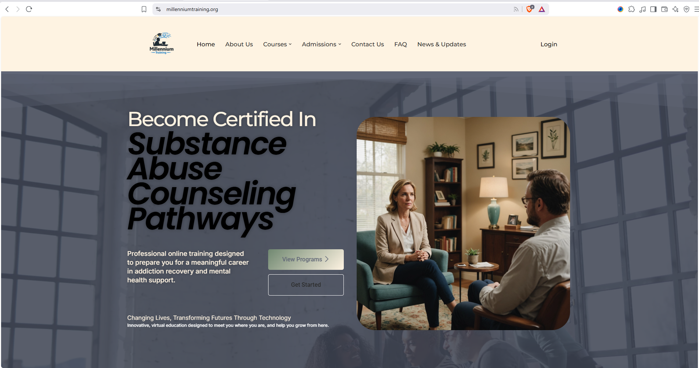
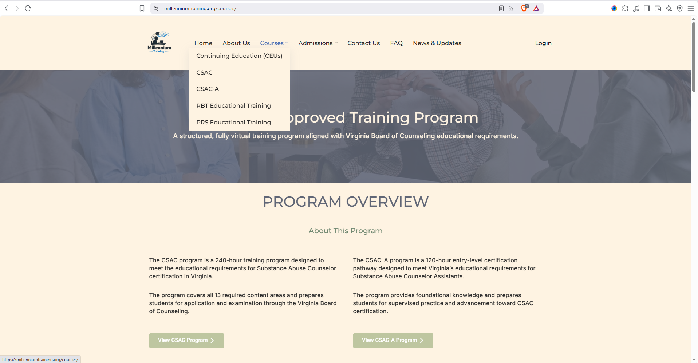
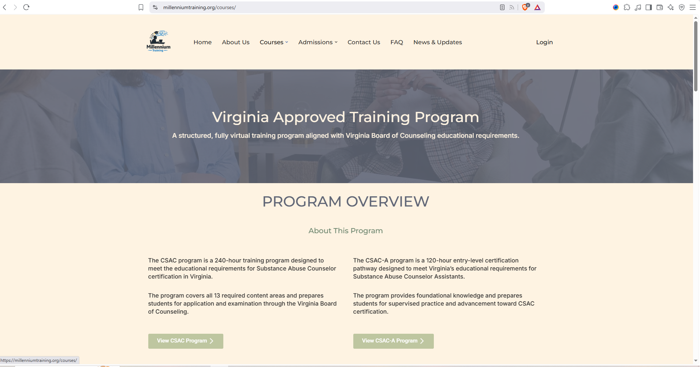
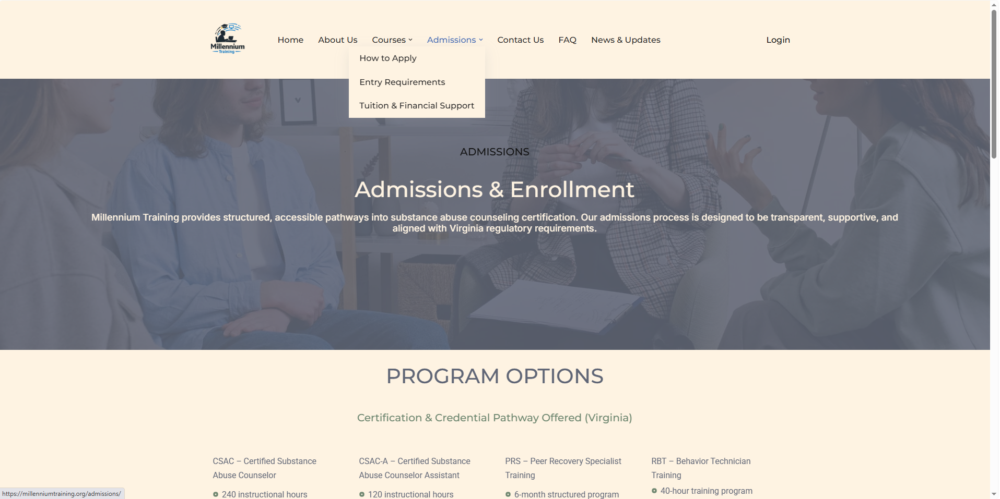
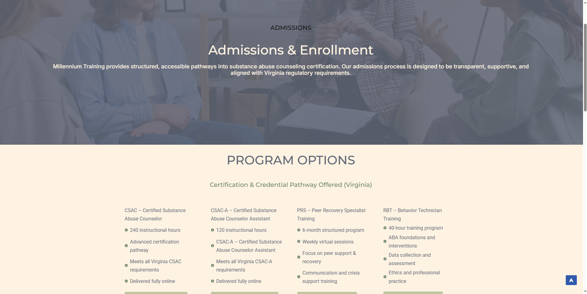
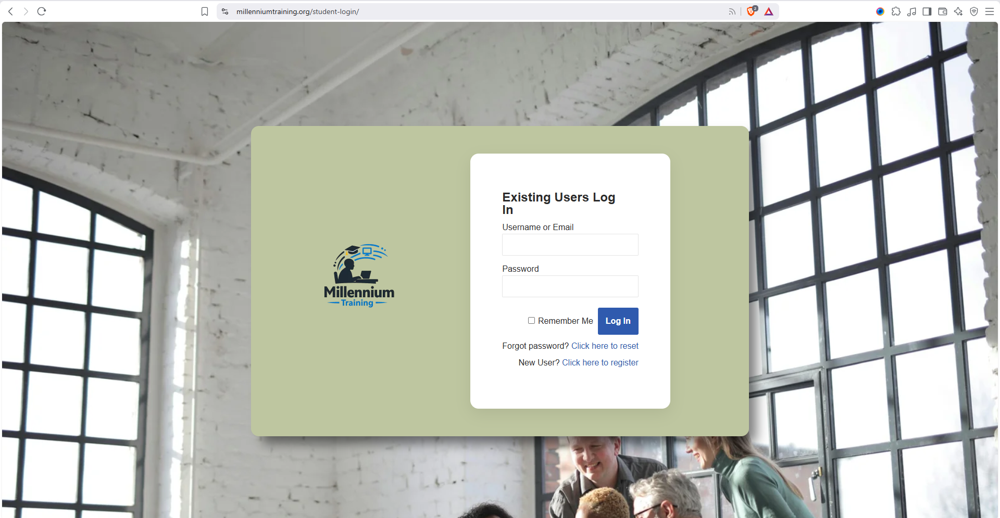
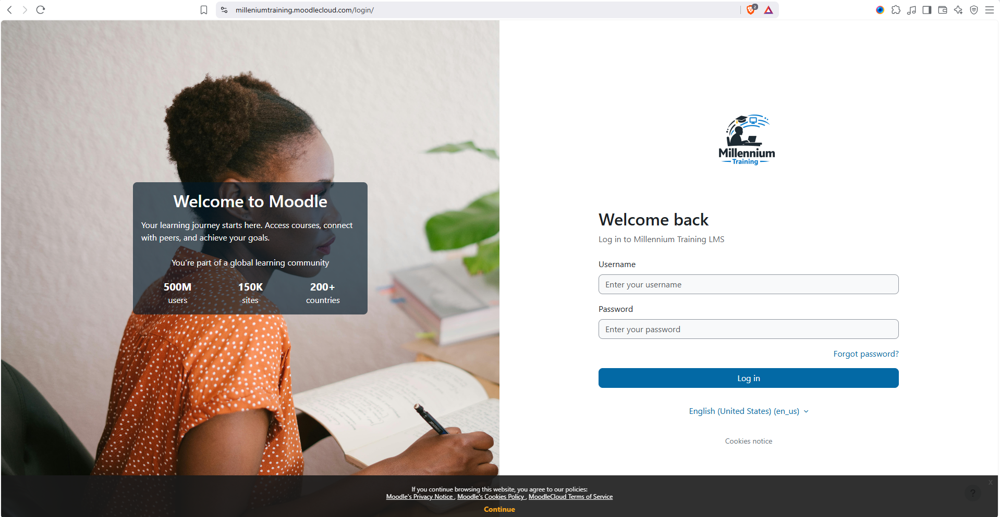

🎓 Millennium Training

Educational Website & Student Portal

A WordPress-based educational platform developed for Millennium Training to streamline student enrollment, orientation, training resources, support services, and LMS access.

🌐 Live Website: https://millenniumtraining.org/

> Note: The live website is maintained by the organization and may change after project handoff. This repository documents the version and features I contributed to during development.

---

👨‍💻 My Role

Web Developer / LMS Administrator

I contributed to the design, development, configuration, and administration of the Millennium Training website and its student-facing systems.

My work focused on creating an accessible educational website while connecting WordPress with student services, forms, orientation workflows, and the organization's Moodle learning environment.

---

🛠️ Technology Stack

- WordPress
- Elementor
- MoodleCloud
- WP-Members
- Forminator
- HTML
- CSS
- Google Workspace / SMTP

✨ Key Features

🔐 Student Portal

Implemented a restricted student portal that provides enrolled students with access to relevant training resources and services.

🎓 Student Orientation

Configured an orientation workflow to help ensure students complete required onboarding steps before accessing their coursework.

📚 LMS Integration

Connected the WordPress student experience with MoodleCloud, allowing students to transition from the main website to their learning environment.

📝 Digital Student Forms

Implemented online forms for processes including:

- Enrollment
- Refund requests
- Appeals
- Accommodation requests
- Transcript requests
- Technical support
- Complaints
- General inquiries

📧 Email Notifications

Configured website email delivery and form notifications using SMTP and Google Workspace.

📱 Responsive Design

Built and optimized website sections using Elementor to provide a consistent experience across desktop, tablet, and mobile devices.

---

🖼️ Project Screenshots

Screenshots documenting the website version developed during the project will be added here.

🏠 Homepage

The homepage was designed to provide prospective and current students with clear access to training programs, admissions information, student services, and learning resources.



🎓 Programs & Courses

Program pages provide students with information about available training pathways, course requirements, and educational opportunities.





📝 Admissions

The admissions experience guides prospective students through enrollment information, requirements, and the next steps for joining Millennium Training.





🔐 Student Login

A dedicated login experience provides students with secure access to protected student resources and services.



📚 Moodle LMS

The website connects students with the Moodle learning environment used for course delivery and training resources.



---

📸 Additional Screenshots

Additional project screenshots are available in the [`screenshots`](screenshots/) directory, documenting more sections of the website and student experience.

---

🔄 Student Journey & System Workflow

The website was designed to support students from initial program discovery through enrollment, orientation, and access to their online coursework.

```text
Prospective Student
        │
        ▼
Millennium Training Website
        │
        ▼
Explore Training Programs
        │
        ▼
Admissions & Enrollment
        │
        ▼
Student Account / Login
        │
        ▼
Student Orientation
        │
        ▼
Student Portal
        │
        ▼
MoodleCloud LMS
        │
        ▼
Online Coursework & Training

```

How the System Works

1. Program Discovery — Prospective students explore available training programs and course information through the WordPress website.

2. Admissions & Enrollment — Students access admissions information and online forms to begin the enrollment process.

3. Student Access — Registered students use the website's authentication system to access protected student resources.

4. Orientation — Students complete the required orientation process before progressing to their learning resources.

5. Student Portal — The protected portal centralizes student resources, forms, support information, and access to learning systems.

6. MoodleCloud — Students transition from the WordPress environment to MoodleCloud for online coursework and training.
